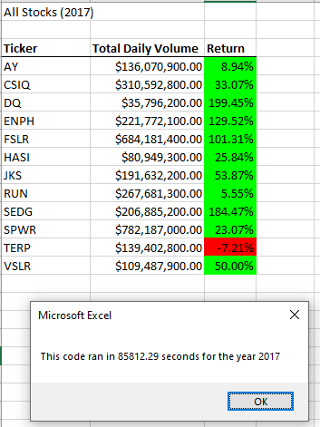
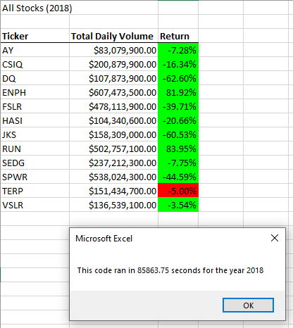
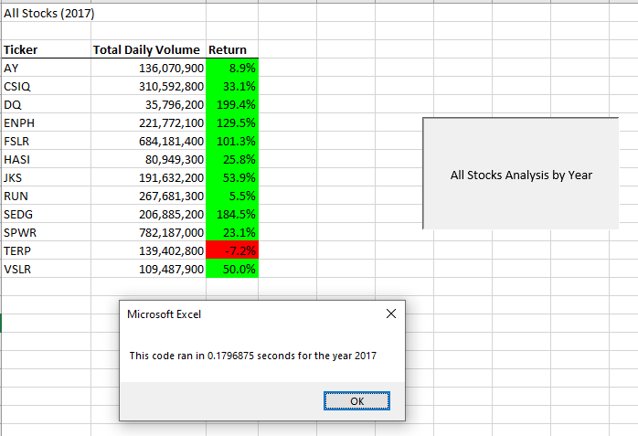
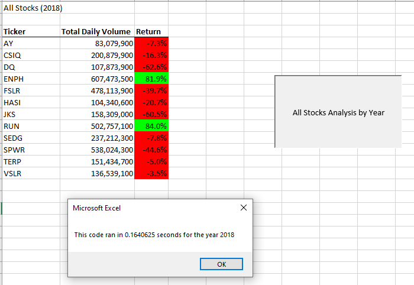

# Refactoring-Analysis

## Overview of the Project

### Purpose

The purpose of this project is to refactor our original code to make if more efficient. By making the code more efficient, it makes the analysis done by the macro faster. This will enable us to analyze even larger data sets in a reasonable time frame.

### Background

We are refactoring our code for a friend named Steve. The original code's analysis found the Total Daily Volume and Annual Return for 12 different stocks. However, Steve now wants to analyze all stocks which will significantly increase our dataset. With such a large increase in stocks, the time it takes to run the analysis will take longer. To keep the time to complete the analysis at an acceptable level, we will need to refactor our code. Refactoring will make the code more efficient and improve the speed of the analysis.

## Results

### Analysis

The original code conducted its analysis by running the For Loop through the stock's tickers array 12 times to determine the Total Daily Volume and Annual return for the 12 different stocks. To determine that information, we needed three different pieces of performance data: tickerVolumes, tickerStartingPrices, and tickerEndingPrices. To make the code more efficient, the goal is to run through the array one time by conducting the For Loop analysis on each stock as the macro goes through the array. The key to running through the tickers array one time is by collecting the three pieces of performance data for each different type of stock as the macro works through the tickers array. To do this, we turned our performance data (tickerVolumes, tickerStartingPrices, and tickerEndingPrices) into arrays. Using an additional variable, "tickerIndex", we can match the three performance arrays with our original tickers array.

By examining the screenshots below, it shows a significant reduction in code run time from the Original code to the Refactored code.

#### Screenshots of the Original Run-time for Each Year

#### Screenshots of the Refactored Run-time for Each Year

#### Original Code

Sub AllStocksAnalysisRefactored()
    Dim startTime As Single
    Dim endTime  As Single

    yearvalue = InputBox("What year would you like to run the analysis on?")

    startTime = Timer
    
    'Format the output sheet on All Stocks Analysis worksheet
    Worksheets("All Stocks Analysis").Activate
    
    Range("A1").Value = "All Stocks (" + yearvalue + ")"
    
    'Create a header row
    Cells(3, 1).Value = "Ticker"
    Cells(3, 2).Value = "Total Daily Volume"
    Cells(3, 3).Value = "Return"

    'Initialize array of all tickers
    Dim tickers(11) As String
    
    tickers(0) = "AY"
    tickers(1) = "CSIQ"
    tickers(2) = "DQ"
    tickers(3) = "ENPH"
    tickers(4) = "FSLR"
    tickers(5) = "HASI"
    tickers(6) = "JKS"
    tickers(7) = "RUN"
    tickers(8) = "SEDG"
    tickers(9) = "SPWR"
    tickers(10) = "TERP"
    tickers(11) = "VSLR"
    
    'Activate data worksheet
    Worksheets(yearvalue).Activate
    
    'Get the number of rows to loop over
    RowCount = Cells(Rows.Count, "A").End(xlUp).Row
    
    '1a) Create a ticker Index
    Dim tickerIndex As Integer
    tickerIndex = 0

    '1b) Create three output arrays
    Dim tickerVolumes(11) As Long
    Dim tickerStartingPrices(11) As Single
    Dim tickerEndingPrices(11) As Single
    
    ''2a) Create a for loop to initialize the tickerVolumes to zero.
    For i = 0 To 11
    
        tickerVolumes(i) = 0
        
    Next i
        
 ''2b) Loop over all the rows in the spreadsheet.
    For i = 2 To RowCount
    
        '3a) Increase volume for current ticker
        tickerVolumes(tickerIndex) = tickerVolumes(tickerIndex) + Cells(i, 8).Value
        
        
        '3b) Check if the current row is the first row with the selected tickerIndex.
        'If  Then
      If tickers(tickerIndex) <> Cells(i - 1, 1).Value Then
        tickerStartingPrices(tickerIndex) = Cells(i, 6).Value
            
        End If
        
        '3c) check if the current row is the last row with the selected ticker
         'If the next row’s ticker doesn’t match, increase the tickerIndex.
        'If  Then
      If tickers(tickerIndex) <> Cells(i + 1, 1).Value Then
        tickerEndingPrices(tickerIndex) = Cells(i, 6).Value

            '3d Increase the tickerIndex.
        tickerIndex = tickerIndex + 1
            
        End If
    
    Next i
    
    '4) Loop through your arrays to output the Ticker, Total Daily Volume, and Return.
    For i = 0 To 11
        Worksheets("All Stocks Analysis").Activate
        Cells(4 + i, 1).Value = tickers(i)
        Cells(4 + i, 2).Value = tickerVolumes(i)
        Cells(4 + i, 3).Value = tickerEndingPrices(i) / tickerStartingPrices(i) - 1
   
    Next i
    
    'Formatting
    Worksheets("All Stocks Analysis").Activate
    Range("A3:C3").Font.FontStyle = "Bold"
    Range("A3:C3").Borders(xlEdgeBottom).LineStyle = xlContinuous
    Range("B4:B15").NumberFormat = "#,##0"
    Range("C4:C15").NumberFormat = "0.0%"
    Columns("B").AutoFit

    dataRowStart = 4
    dataRowEnd = 15

    For i = dataRowStart To dataRowEnd
        
        If Cells(i, 3) > 0 Then
            
            Cells(i, 3).Interior.Color = vbGreen
            
        Else
        
            Cells(i, 3).Interior.Color = vbRed
            
        End If
        
    Next i
 
    endTime = Timer
    MsgBox "This code ran in " & (endTime - startTime) & " seconds for the year " & (yearvalue)

End Sub

#### Refactored Code 

Sub AllStocksAnalysisRefactored()
    Dim startTime As Single
    Dim endTime  As Single

    yearvalue = InputBox("What year would you like to run the analysis on?")

    startTime = Timer
    
    'Format the output sheet on All Stocks Analysis worksheet
    Worksheets("All Stocks Analysis").Activate
    
    Range("A1").Value = "All Stocks (" + yearvalue + ")"
    
    'Create a header row
    Cells(3, 1).Value = "Ticker"
    Cells(3, 2).Value = "Total Daily Volume"
    Cells(3, 3).Value = "Return"

    'Initialize array of all tickers
    Dim tickers(11) As String
    
    tickers(0) = "AY"
    tickers(1) = "CSIQ"
    tickers(2) = "DQ"
    tickers(3) = "ENPH"
    tickers(4) = "FSLR"
    tickers(5) = "HASI"
    tickers(6) = "JKS"
    tickers(7) = "RUN"
    tickers(8) = "SEDG"
    tickers(9) = "SPWR"
    tickers(10) = "TERP"
    tickers(11) = "VSLR"
    
    'Activate data worksheet
    Worksheets(yearvalue).Activate
    
    'Get the number of rows to loop over
    RowCount = Cells(Rows.Count, "A").End(xlUp).Row
    
    '1a) Create a ticker Index
    Dim tickerIndex As Integer
    tickerIndex = 0

    '1b) Create three output arrays
    Dim tickerVolumes(11) As Long
    Dim tickerStartingPrices(11) As Single
    Dim tickerEndingPrices(11) As Single
    
    ''2a) Create a for loop to initialize the tickerVolumes to zero.
    For i = 0 To 11
    
        tickerVolumes(i) = 0
        
    Next i
        
 ''2b) Loop over all the rows in the spreadsheet.
    For i = 2 To RowCount
    
        '3a) Increase volume for current ticker
        tickerVolumes(tickerIndex) = tickerVolumes(tickerIndex) + Cells(i, 8).Value
        
        
        '3b) Check if the current row is the first row with the selected tickerIndex.
        'If  Then
      If tickers(tickerIndex) <> Cells(i - 1, 1).Value Then
        tickerStartingPrices(tickerIndex) = Cells(i, 6).Value
            
        End If
        
        '3c) check if the current row is the last row with the selected ticker
         'If the next row’s ticker doesn’t match, increase the tickerIndex.
        'If  Then
      If tickers(tickerIndex) <> Cells(i + 1, 1).Value Then
        tickerEndingPrices(tickerIndex) = Cells(i, 6).Value

            '3d Increase the tickerIndex.
        tickerIndex = tickerIndex + 1
            
        End If
    
    Next i
    
    '4) Loop through your arrays to output the Ticker, Total Daily Volume, and Return.
    For i = 0 To 11
        Worksheets("All Stocks Analysis").Activate
        Cells(4 + i, 1).Value = tickers(i)
        Cells(4 + i, 2).Value = tickerVolumes(i)
        Cells(4 + i, 3).Value = tickerEndingPrices(i) / tickerStartingPrices(i) - 1
   
    Next i
    
    'Formatting
    Worksheets("All Stocks Analysis").Activate
    Range("A3:C3").Font.FontStyle = "Bold"
    Range("A3:C3").Borders(xlEdgeBottom).LineStyle = xlContinuous
    Range("B4:B15").NumberFormat = "#,##0"
    Range("C4:C15").NumberFormat = "0.0%"
    Columns("B").AutoFit

    dataRowStart = 4
    dataRowEnd = 15

    For i = dataRowStart To dataRowEnd
        
        If Cells(i, 3) > 0 Then
            
            Cells(i, 3).Interior.Color = vbGreen
            
        Else
        
            Cells(i, 3).Interior.Color = vbRed
            
        End If
        
    Next i
 
    endTime = Timer
    MsgBox "This code ran in " & (endTime - startTime) & " seconds for the year " & (yearvalue)

End Sub

## Summary

### Pros and Cons of Refactoring Code

The advantage of refactoring code is making the code more efficient. The disadvantage of refactoring code is that we may break our original code that is working.

### Pros and Cons of Refactoring our Original VBA Code 

The advantage of refactoring our original VBA code is we can analyze all the stocks quickly as opposed to sitting around waiting for the macro to finish processing. This allows us to make strategic decisions quicker thereby improving our performance on the stock market. The major disadvantage of refactoring our original VBA code is that it is currently works even if it's a little slower. Changing the VBA code's syntax can break our working code which may take a considerable amount of resources to debug.
